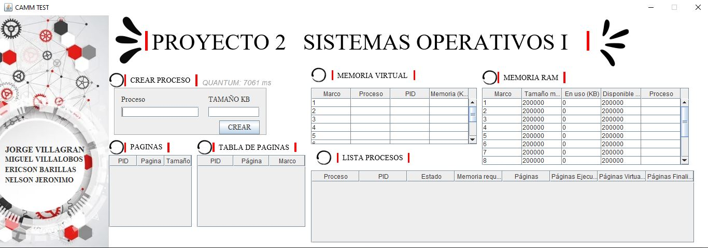
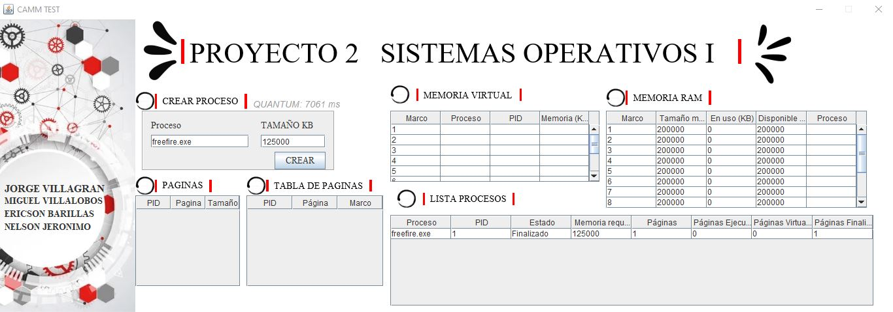
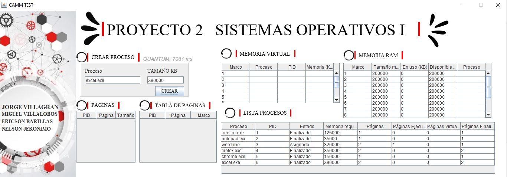

# *
  **Manual de Usuario**  
*

### ***Al iniciar la Aplicacion***

*Se debe generar de forma aleatoria un valor entre 1000 a 10000 que serán los mili-segundos que deberán estar los procesos en memoria y se llamara quantum.*

*Iniciamos creando un proceso y asignando el tamaño del mismo* 

---

### ***Metodo de Guardado***

*Las tablas de procesos y asignación de memoria se encuentran vacías y segun se van registrando procesos estos se ven reflejados en la misma, se irán llenando según el usuario vaya creando proceso por cada creación de proceso se le debe solicitar al usuario el nombre del proceso y el espacio de memoria.*

---

### ***Limitantes***

*La capacidad total de la memoria es de 2048 MB y los procesos no pueden sobrepasar los 4000000 KB y los bloques de memoria deben ser de 200000KB.*

*segun sean inscritos los procesos estos apareceran enlistados en un maximo de 15 de manera simultanea.*

## ***Codigo del Programa:***

---
---

~~~java

package proyecto2;

import javax.swing.JTable;

/***/
public class Main  {
    
    //MyThread[10] memory = MyThread[10];
    /**
     * @param args the command line arguments
     */
    public static void main(String[] args) {
        // TODO code application logic here
        MyThread hilo1 = new MyThread();
        MyThread hilo2 = new MyThread();
        
        hilo1.start();
        hilo2.start();
        
        view tabla = new view();
        
        tabla.setVisible(true);
        
    }
    
}
~~~
